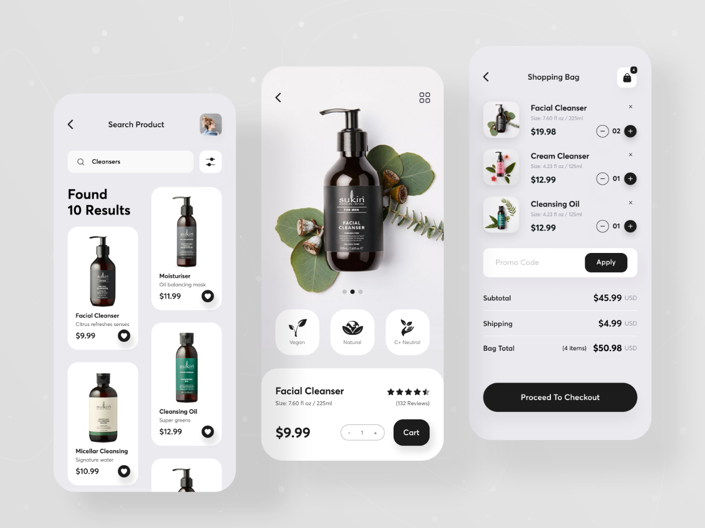

> BeautyBlend : Your ultimate Beauty Hub
> 

> Follow us for more projects like this [Check on our website](https://codewithvetri.web.app)

BeautyBlend is an exciting project that combines the power of React Native and Sanity to create a captivating hybrid mobile app for a beauty product shop. In this project, you will have the opportunity to learn and explore various technologies, including:

# React Native

```
React Native is a popular JavaScript framework that allows you to build native mobile apps using a single codebase. You will learn how to develop cross-platform mobile applications for both iOS and Android platforms, leveraging the efficiency and flexibility of React Native.
```

# Sanity.IO

```
Sanity is a highly customizable and collaborative content management system (CMS) that enables you to manage and deliver content seamlessly. You will dive into Sanity's features and learn how to integrate it into your React Native app to handle product information, images, descriptions, and other relevant data.
```

# Hybrid App Development

```
By using React Native, you will gain experience in building hybrid mobile apps, which provide the advantage of code reusability across multiple platforms. This project will help you understand the fundamentals of hybrid app development and how to leverage the strengths of React Native to deliver a consistent user experience on both iOS and Android.
```

# UI/UX Designs

```
Creating an appealing and user-friendly interface is crucial for a beauty product shop app. You will have the opportunity to enhance your UI/UX design skills and implement intuitive navigation, stunning visuals, and smooth animations to provide an engaging user experience.
```

# API Integrations

```
You will learn how to interact with external APIs to fetch additional data, such as user reviews, product ratings, and stock availability. This integration will allow you to provide up-to-date information to users and enhance the functionality of the app.
```

# To create an expo app

```
expo init
```

# To start the sanity server

```
yarn dev
```
